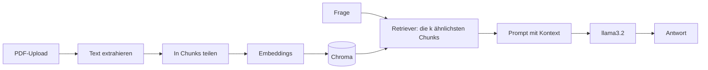

# RAG-Assistent

Ein Chat mit eigenen PDF-Dokumenten. Man lädt PDFs hoch, stellt Fragen, und das Modell antwortet nur auf Basis dieser Dokumente. Steht die Antwort nicht darin, sagt es das ehrlich. Alles läuft lokal mit Ollama.

<!-- TODO: Screenshot oder kurzes GIF der App einfügen:

Lege das Bild in einen Ordner, der nicht in der .gitignore steht (z. B. assets/). -->

## So funktioniert es



1. Die PDFs werden in Text umgewandelt und in Chunks (1000 Zeichen, 200 Überlappung) geteilt.
2. Jeder Chunk wird mit `nomic-embed-text` in einen Vektor umgewandelt und in Chroma gespeichert.
3. Bei einer Frage holt der Retriever die k ähnlichsten Chunks.
4. `llama3.2` bekommt diese Chunks als Kontext und soll nur daraus antworten.

## Funktionen

- PDF-Upload direkt in der App (mehrere Dateien gleichzeitig)
- Chat mit Verlauf in der Oberfläche
- Anzeige der Quellen unter der Antwort
- Einstellungen in der Sidebar: Anzahl der Treffer (k) und Temperature
- Button zum Zurücksetzen der Wissensbasis
- Die Datenbank bleibt gespeichert, die PDFs müssen nicht bei jedem Start neu verarbeitet werden

<!-- TODO: Prüfe vor dem Push, ob jeder Punkt wirklich funktioniert. Streiche, was nicht stimmt. -->

## Technik

Python, Streamlit, LangChain, Chroma, Ollama (`llama3.2` für Antworten, `nomic-embed-text` für Embeddings), pypdf

## Setup

```powershell
git clone https://github.com/NabinAd/RAG-Assistent
cd RAG-Assistant

python -m venv .venv
.\.venv\Scripts\Activate.ps1
pip install -r requirements.txt

ollama pull llama3.2
ollama pull nomic-embed-text

streamlit run app.py
```

Ollama muss dabei im Hintergrund laufen.

## Benutzung

1. Tab **Dokumente hochladen**: PDFs auswählen und auf "Dokumente verarbeiten" klicken.
2. Tab **Chat**: Frage stellen.
3. Bei neuen oder geänderten PDFs: in der Sidebar "Vector Store zurücksetzen" und die PDFs neu hochladen.

## Dateien

| Datei | Inhalt |
|---|---|
| `app.py` | Streamlit-App (Upload, Vector Store, Chat) |
| `rag_basic.py` | Erster Prototyp ohne Oberfläche, liest PDFs aus `docs/` und beantwortet eine Frage im Terminal |
| `docs/` | Eigene PDFs für den Prototyp (nicht im Repo) |
| `chroma_db/` | Wird automatisch erzeugt (nicht im Repo) |

## Entscheidungen

- **Chunk-Größe 1000, Überlappung 200:** groß genug, dass ein Abschnitt seinen Zusammenhang behält, mit Überlappung, damit an den Schnittstellen keine Information verloren geht.
- **Lokale Modelle:** keine Kosten, keine Dokumente verlassen den Rechner.
- **Prompt:** Das Modell soll nur aus dem Kontext antworten und sonst zugeben, dass es nichts weiß. Das verringert erfundene Antworten.

## Grenzen

- Der Chat hat kein Gedächtnis: Jede Frage wird einzeln beantwortet, der Verlauf wird nur angezeigt.
- Die angezeigten Quellen nennen nur den Dateinamen, keine Seitenzahl.
- Nur PDFs mit Text. Gescannte PDFs ohne Textebene funktionieren nicht.
- Dieselbe PDF mehrfach hochzuladen erzeugt doppelte Chunks.
- `nomic-embed-text` ist überwiegend auf Englisch trainiert, bei deutschen Dokumenten kann die Suche schwächer sein.
- Die Antwortqualität hängt stark vom kleinen Modell `llama3.2` ab.
